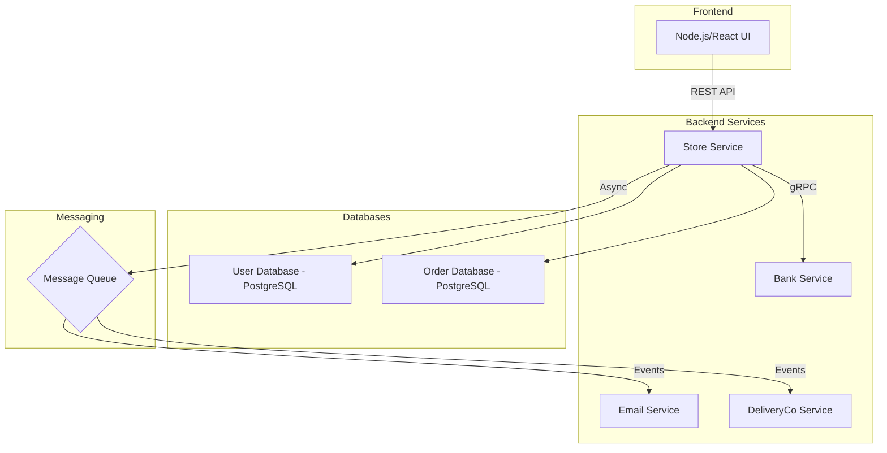
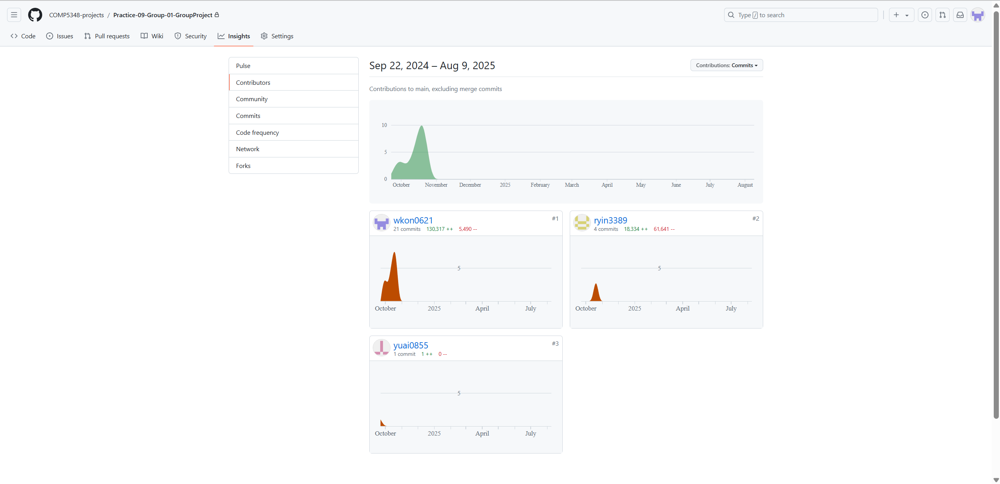
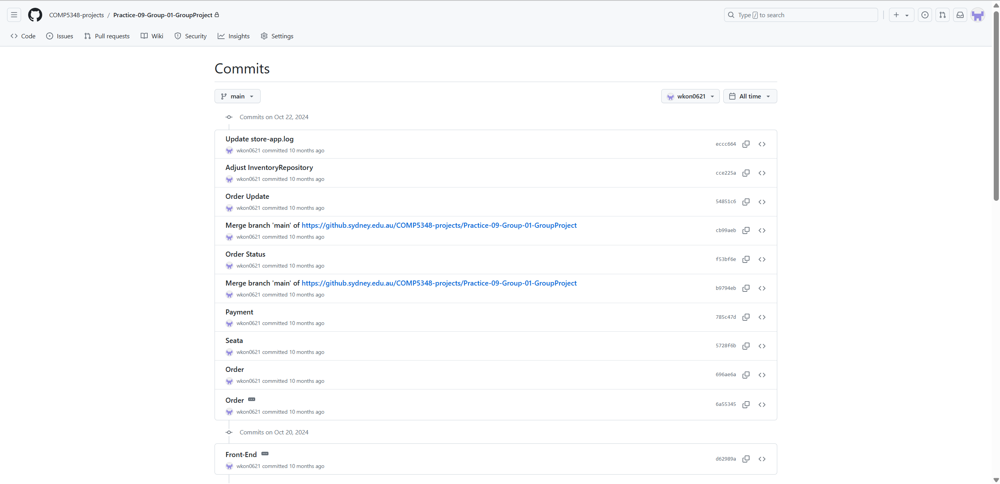
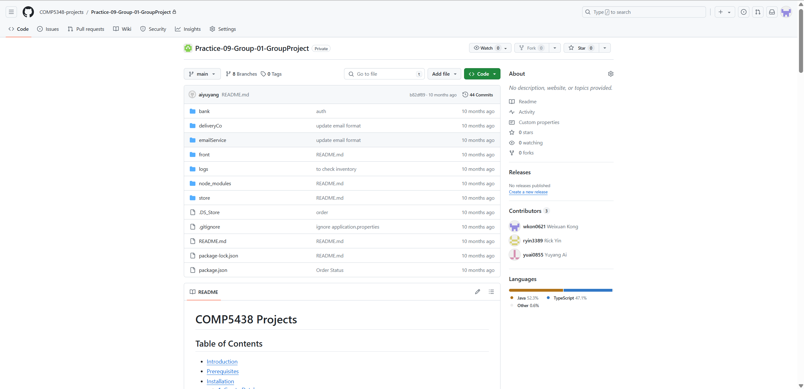

# Showcase: Enterprise Microservice System for Online Retail

> **Note:** This repository is a public showcase for a private team project completed as part of the COMP5348 course at the University of Sydney. The original repository is hosted on a private university server and is not publicly accessible. The purpose of this repository is to demonstrate the overall project architecture and my contributions as part of the team.

---

## 1. Project Overview

This project is a comprehensive, enterprise-level e-commerce platform built on a microservices architecture. It simulates a real-world online retail environment, encompassing inventory management, customer transactions, order processing, and notifications. The system is composed of several independent yet interconnected services that work together to provide a seamless user experience, from browsing products to receiving order confirmation emails.

The primary goal was to design and implement a robust, scalable, and maintainable system, applying industry best practices in distributed systems, database management, and inter-service communication.

---

## 2. Team Members

This project was a collaborative effort. The team members are:

*   @wkon0621 (Weixuan Kong)
*   @pyin3389 (Rick Yin)
*   @yuai0855 (Yuang Ai)

---

## 3. Architecture & Tech Stack

The system is built on a decoupled microservices architecture, promoting separation of concerns and independent scalability.

### Architecture Diagram
*(This is a conceptual diagram based on the project structure)*

### Technology Stack

| Category          | Technology / Tool                               |
| ----------------- | ----------------------------------------------- |
| **Backend**       | Java (JDK 11+), Spring Boot, Gradle             |
| **Frontend**      | Node.js, npm, (React/Vue/Angular) |
| **Database**      | PostgreSQL                                      |
| **Communication** | RESTful APIs, gRPC, Message Queuing (RabbitMQ/Kafka) |
| **DevOps**        | Git, GitHub                                     |

---

## 4. Proof of Contribution

The following screenshots are provided as evidence of my work on the original private repository. All evidence has been moved to the `_meta` directory.

### A. Contributor Statistics
*(This image shows the contribution graph from the private repository, highlighting my activity.)*

### B. Personal Commit History
*(A snapshot of my personal commit log, demonstrating my development process and specific contributions.)*

### C. Project Team Homepage
*(The project's main page on the private university GitHub, showing all team members.)*

